# 🏡 Tu Portal Inmobiliario

## Descripción

**Tu Portal Inmobiliario** es un sistema CRUD desarrollado para la gestión de propiedades inmobiliarias. Permite a los usuarios agregar, visualizar, actualizar y eliminar propiedades a través de una interfaz web intuitiva y amigable. Este sistema se construyó con un frontend en HTML, CSS y JavaScript, un backend en Spring Boot, y una base de datos MySQL, con despliegue en AWS.

---


## 📍 Comenzando

Estas instrucciones te permitirán obtener una copia del proyecto en funcionamiento en tu máquina local para propósitos de desarrollo y pruebas.

### 🔧 Prerrequisitos

Debes instalar los siguientes componentes:

- [Java JDK 8 o superior](https://www.oracle.com/java/technologies/javase-jdk11-downloads.html)
- [Maven](https://maven.apache.org/download.cgi)
- [Git](https://git-scm.com/)
- [MySQL](https://dev.mysql.com/downloads/installer/)
- [DBeaver](https://dbeaver.io/download/)
- Un navegador Web
- Utiliza el entorno de desarrollo integrado (IDE) de tu preferencia, como por ejemplo:
    - IntelliJ IDEA
    - Eclipse
    - Apache NetBeans

### ⚙️ Instalación

1. **Clona el repositorio:**
   ```sh
   git clone https://github.com/saraygonm/Lab06-AREP.git
   ```

2. **Entra en la carpeta del proyecto:**
   ```sh
   cd LAB06-AREP
   ```

3. **Compila el proyecto con Maven:**
   ```sh
   mvn clean package
   ```

4. **Inicia el servidor:**
   ```sh
   mvn spring-boot:run
   ```

5. **Accede a la aplicación en el navegador:**
   ```
   http://localhost:8080
   ```

* Una vez iniciado el servidor, podrás visualizar la página web en tu navegador.


<p align="center">
  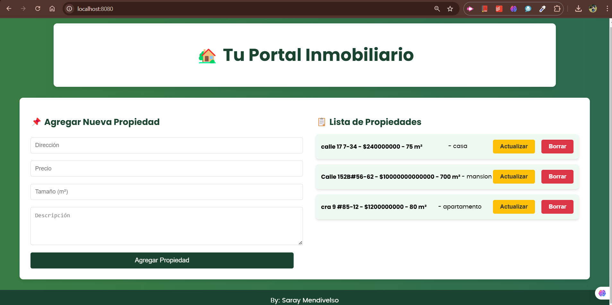
</p>

---

## ✅ Ejecutar las pruebas

Para ejecutar las pruebas automáticas, el servidor debe estar en ejecución:

```sh
mvn clean test
```

<!-- Imagen de ejemplo -->
| 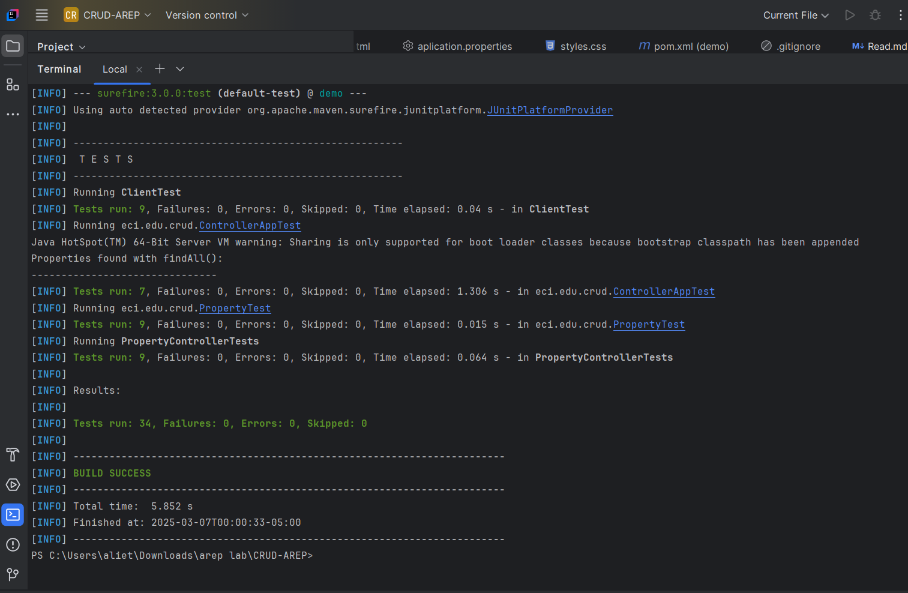 |
|--------------------------------------------------------------------------------------------|
| **Imagen 1: Pruebas exitosas**                                                             |

Las pruebas incluyen validaciones de:
- ClientTest: Pruebas de integración con la API.
- ControllerAppTest: Verifica la configuración del controlador principal.
- PropertyControllerTests: Pruebas CRUD para PropertyController.
- PropertyTest: Verifica la entidad Property y su correcto funcionamiento.
---

## 🏢 Base de Datos

Se utiliza **MySQL** como sistema de gestión de bases de datos. La estructura de la tabla `properties` es la siguiente:

| Campo       | Tipo         | Descripción                     |
|------------|-------------|---------------------------------|
| id         | BIGINT      | Identificador único de la propiedad |
| address    | VARCHAR(255)| Dirección de la propiedad      |
| price      | DOUBLE      | Precio de la propiedad        |
| size       | INT         | Tamaño en metros cuadrados    |
| description| TEXT        | Descripción de la propiedad   |

La conexión con MySQL está configurada en el archivo `application.properties` dentro de `src/main/resources/`.

**Visualización DBEAVER**
<p align="center">
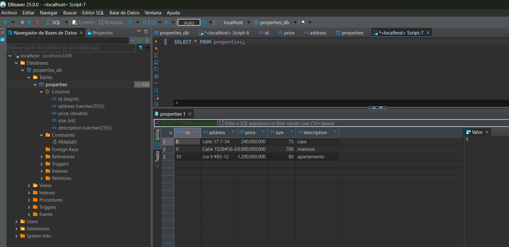
</p>

---

## 🏗️ Arquitectura

### 📌 Diagrama de Clases

<p align="center">
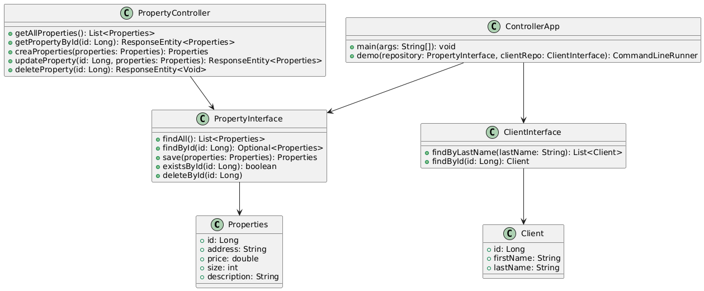
</p>

### 📌 Diagrama de Secuencia

<p align="center">
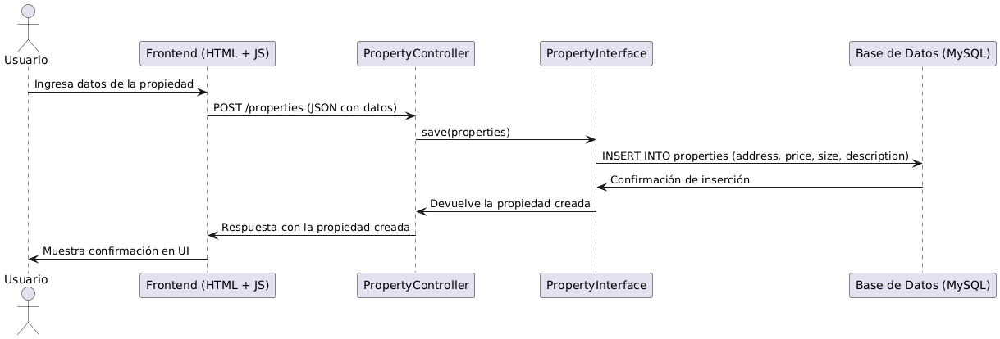
</p>

### 📌 Diagrama de Despliegue

<p align="center">
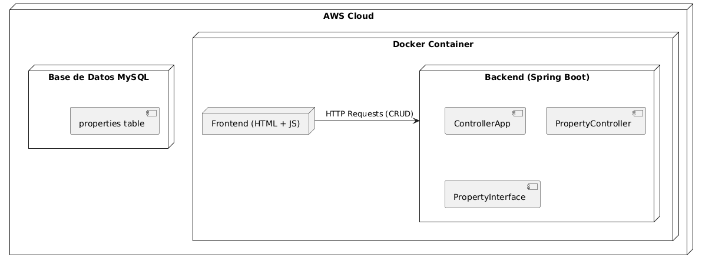
</p>

### 📌 Diagrama de Componentes

<p align="center">
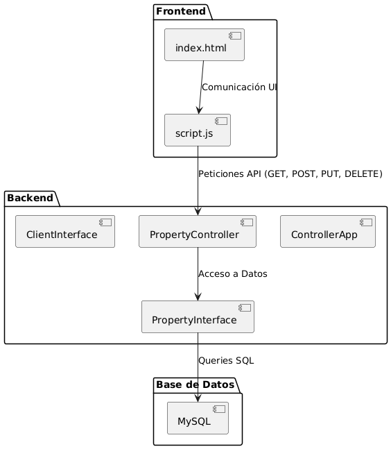
</p>

---

## 🌐 Frontend

El sistema cuenta con una interfaz web desarrollada en **HTML, CSS y JavaScript**.

- **`index.html`**: Interfaz de usuario con formularios y listados de propiedades.
- **`style.css`**: Hoja de estilos para mejorar la apariencia visual.
- **`script.js`**: Lógica del cliente para la comunicación con la API REST.

---

## 🌐 Funcionalidad

### Agregar
<!-- Creación de tabla para alinear las imágenes lado a lado.-->
| 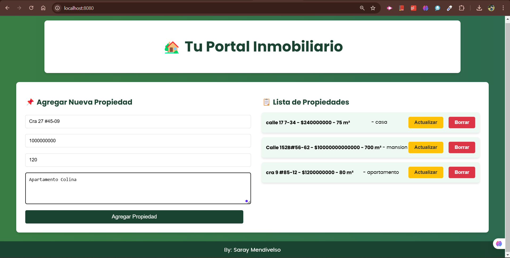 |  |
|--------------------------------------------------------------------------|-------------------------------------------------------------------------|
| **LLenamos los datos**                                                   | **Se agrega**                                                           |


### Actualizar 
<!-- Creación de tabla para alinear las imágenes lado a lado.-->
| 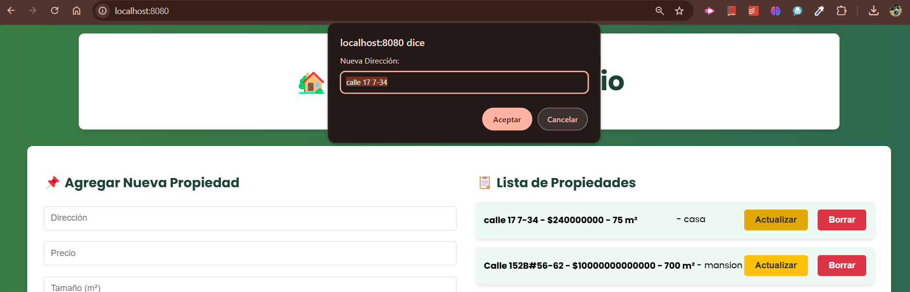 | 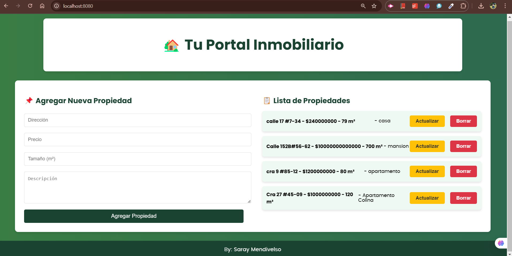 | 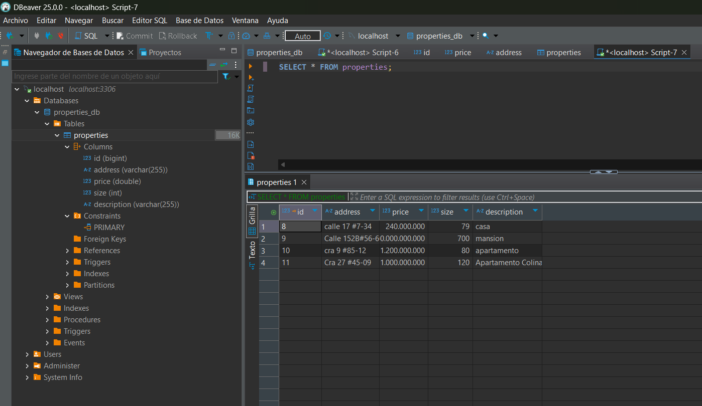 |
|-----------------------------------------------------------------------------|----------------------------------------------------|----------------------------------------------------------------------|
| **Actualizar agregando el # y 79m2**                                        | **Actualizada**                                    | **Base de datos**                                                    |

### Borrar
<!-- Creación de tabla para alinear las imágenes lado a lado.-->
<!-- Creación de tabla para alinear las imágenes lado a lado.-->
| 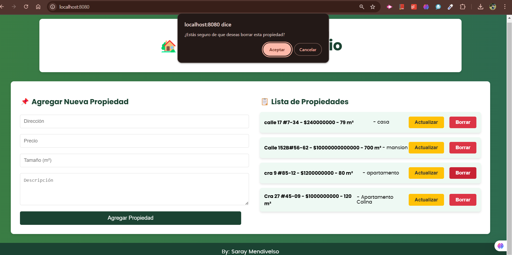 | 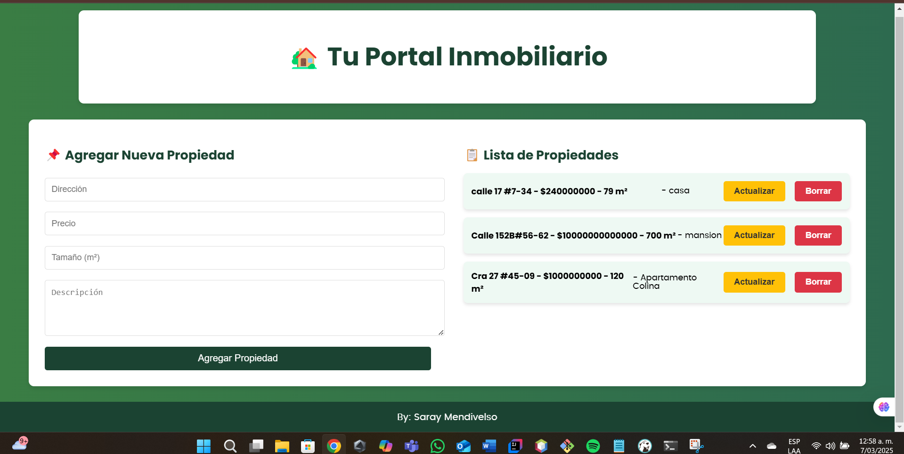 | 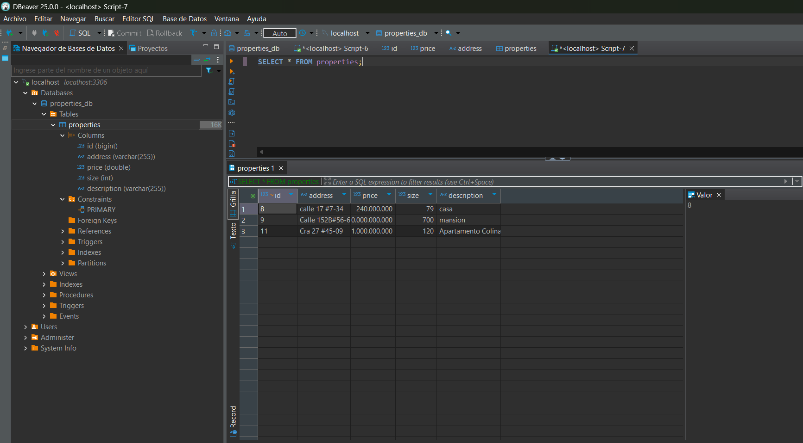 |
|----------------------------------------------------------------------------|----------------------------------------------------------------------------|----------------------------------------------------------------------|
| **Eliminamos la propiedad apartamento**                                    | **Eliminada**                                                              | **Base de datos**                                                    |


## Diseño Seguro de Aplicaciones BACKEND
### 1.  Configuración TLS/SSL en Spring Boot
- Es necesario para habilitar el navegador seguro en la aplicación **HTTPS**
- El certificado TLS cifrará la comunicación.

  - Ejecutando el siguiente comando se generará un **par de claves** y un certificado en formato  **PKCS12**  :
       ```sh
       keytool -genkeypair -alias ecikeypair -keyalg RSA -keysize 2048 -storetype PKCS12 -keystore ecikeystore.p12 -validity 3650
       ```
  - Seguidamente completamos la información dejando localhost como primer respuesta para evitar inconvenientes de depuración 
    
  - En retrospectiva estos son los datos que se usaron: 
    <p align="center">
    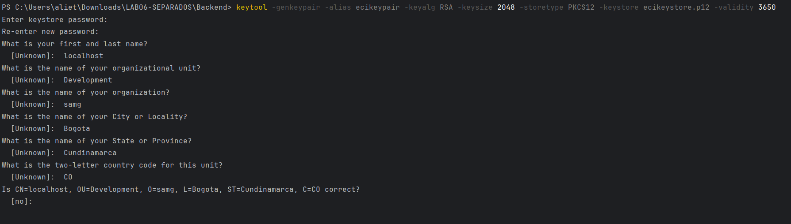
    </p>
  
  - Una vez que hemos generado un keystore (ecikeystore.p12 con el certificado TLS del backend), debemos **exportar** solo el certificado público. 
  Este certificado permitirá a otros sistemas confiar en el backend.
       ```sh
       keytool -export -keystore ecikeystore.p12 -alias ecikeypair -file ecicert.cer
       ```
      <p align="center">
        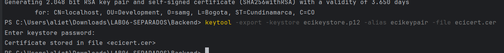
      </p>
  
  - Ahora que tenemos el archivo ecicert.cer, debemos **importarlo** a un TrustStore. 
  Un TrustStore es un almacén que guarda certificados en los que una aplicación confía.
       ```sh
       keytool -import -file ecicert.cer -alias firstCA -keystore myTrustStore
       ```

    <p align="center">
        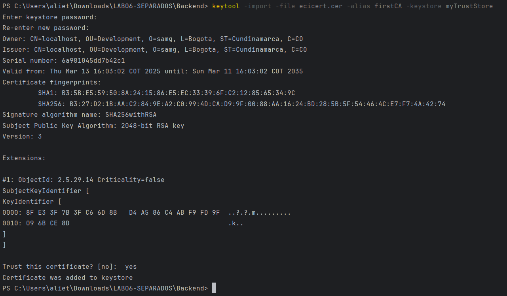
    </p>

### 2. Configuración application.properties para HTTPS
- Se agrega al archivo application.properties
```sh
# Spring Boot para HTTPS
server.port=5000
server.ssl.key-store=classpath:ecikeystore.p12
server.ssl.key-store-password=123456
server.ssl.key-store-type=PKCS12
server.ssl.key-alias=ecikeypair
server.ssl.enabled=true

```


## Diseño Seguro de Aplicaciones FRONTEND

### 1. Ejecutamos estos comandos en la terminal del frontend para obtener un certificado de Let’s Encrypt

- En mi caso mediante la terminal de Ubuntu en WSL ejecute: 
```sh
openssl req -x509 -nodes -days 365 -newkey rsa:2048 -keyout selfsigned.key -out selfsigned.crt
```
<p align="center">
  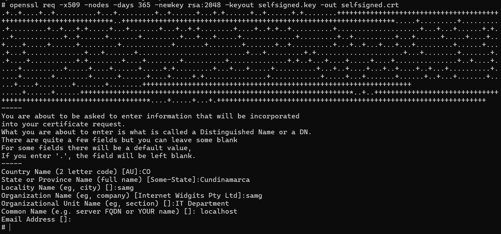
</p>

- Una vez que ingresamos todos los datos, se generarán dos archivos:
selfsigned.key (Clave privada)
selfsigned.crt (Certificado autofirmado)

- Dado que estamos en la terminal del pc debemos mover estos archivos a Windows para configurarlos en Apache
```sh
mv selfsigned.key selfsigned.crt /mnt/c/Users/aliet/Downloads/LAB06-SEPARADOS/Frontend/

```
<p align="center">
  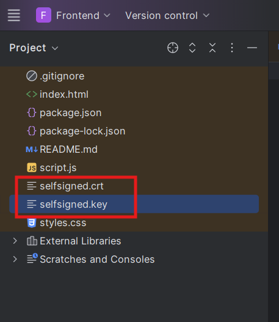
</p>


### 2. Configuración del servidor local con HTTPS
- Se utilizó http-server para servir el frontend con SSL:

```sh
npx http-server -p 3000 --ssl --cert frontend.crt --key frontend.key

```

### 3. Modificación de script.js
- Se actualizó la API del backend para que las peticiones se realicen sobre HTTPS:
```sh
const apiUrl = 'https://localhost:5000/properties';
```
<p align="center">
  
</p>

-  Se corrigieron errores de CORS y contenido mixto (Mixed Content) asegurando que tanto el frontend como el backend operen bajo HTTPS.

---------------

## Autenticación 
### Con almacenamiento segurode contraseñas mediante hashing.


Este proyecto utiliza un sistema de **autenticación de usuarios** con almacenamiento seguro de contraseñas utilizando **hashing criptográfico**. Las contraseñas de los usuarios nunca se almacenan en texto plano, sino que se transforman en un valor irreversible utilizando algoritmos de hashing.

### Funcionamiento

#### 1. **Registro de Usuario**
Cuando un usuario se registra, la contraseña ingresada pasa por un algoritmo de hashing (en este caso, **BCrypt**). El resultado de este proceso es una cadena de texto única que se almacena en la base de datos.

#### 2. **Inicio de Sesión**
Al intentar iniciar sesión, la contraseña ingresada por el usuario se pasa nuevamente por el algoritmo de hashing. El valor resultante se compara con el valor almacenado en la base de datos. Si ambos coinciden, las credenciales son consideradas correctas y el acceso es otorgado.

<p align="center">
  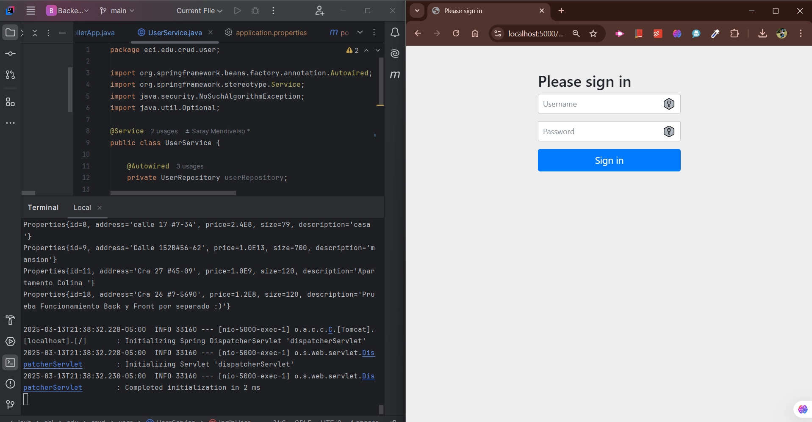
</p>

#### 3. **Uso de BCrypt**
Se utiliza el algoritmo **BCrypt** para el hashing de contraseñas debido a su alta seguridad frente a ataques de **fuerza bruta**. Además, BCrypt genera un **salto aleatorio** (salt) que asegura que incluso si dos usuarios tienen la misma contraseña, sus valores hasheados serán diferentes.

### Beneficios
- **Seguridad**: Almacenamiento seguro de contraseñas mediante hashing, evitando que las contraseñas se expongan.
- **Resistencia a ataques**: La utilización de BCrypt dificulta significativamente los ataques de fuerza bruta.
- **Privacidad**: El valor almacenado en la base de datos nunca puede ser revertido a la contraseña original.


-------------------
## 🚀 Despliegue en AWS

Para el despliegue en AWS, se siguen los siguientes pasos:

1. **Configurar una instancia EC2** con acceso a MySQL.
2. **Configurar una base de datos en RDS** con MySQL.
3. **Construir y subir una imagen Docker** del backend.
4. **Ejecutar la aplicación** en un servidor Nginx o en una instancia EC2 con Docker.

---

## 🛠️ Tecnologías Utilizadas

- **Java** - Lenguaje de programación principal
- **Spring Boot** - Framework backend
- **MySQL** - Base de datos relacional
- **JPA/Hibernate** - ORM para gestión de datos
- **Maven** - Gestor de dependencias
- **Docker** - Contenedorización
- **AWS** - Despliegue en la nube

---

## 👨🏼‍💻 Autora

**Saray Mendivelso** - Desarrollo inicial

---

### 📺 Video de Demostración

[](https://www.youtube.com/watch?v=VID)

Video demostrativo 